# Arquitecturas de Software
# Laboratorio 1 Paralelismo y Concurrencia

## Integrantes
- David Alejandro Vasquez Carreño
- Michael Jefferson Ballesteros Coca

____________

#### Parte 1 - Introduction to threads in JAVA

1. Implementación de clase CountThread, cuyo objetivo es imprimir los números entre un rango dado A y B.

      ```
    public class CountThread extends Thread{
        private int left;
        private int right;
    
        public CountThread(int left, int right){
            super();
            this.left=left;
            this.right=right;
        }
    
        @Override
        public void run() {
            for(int i=left; i<right ;i++){
                System.out.println(i);
            }
        }
    }
      ```

2. Completar el método main de manera que: 
    1. Cree 3 threads de tipo CountThread, asignando el primer intervalo de  [0..99], el segundo de  [99..199], y el tercero de  [200..299].
    
         ```
           Thread t1 = new CountThread(0, 99);
           Thread t2 = new CountThread(99, 199);
           Thread t3 = new CountThread(200, 299);
         ```
    2. Inicie los 3 threads con **start()**. Corra y mire el resultado en pantalla.
    
          Cuando el hilo se ejecuta con el metodo start() se crea un nuevo subproceso. Podemos ver que ejecutando varias veces el método principal, diferentes resultados se ven reflejados, ya que no estan sincronizados por el procesador. Vemos que se puede ejecutar el tercer hilo de primeras, mientras que el primero se ejecuta después el segundo.
  
        ***Los hilos se interrumpen***
        
        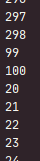
        
        Vemos la ejecución del hilo 2 se ve interrumpida por la ejecución del hilo 1. Esto indica que existen distintos procesos ligeros en el computador.

        ***El primer hilo se ve interrumpido por el segundo***
        
        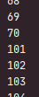

        ***El primer hilo se ve interrumpido por el tercero***
        
        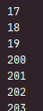
          
  3. Cambie el inicio de los hilos de **start()** a **run()**. ¿Qué pasa? ¿Por qué?
  
        Usando run() para ejecutar los hilos, podemos verificar que se ejecutan sobre el hilo principal, por lo que no se han creado otros procesos que nos beneficien de concurrencia.

        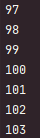

        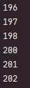
        
        Vemos que hay un orden secuencial, por lo que los números siguen el orden en el que fueron ejecutados los métodos **run()**.
      
________________

#### Part II - Black List Search Exercise

Vamos a refactorizar el código principal para que pueda explotar las capacidades multo-core del procesador. 

1. Cree la clase Thread, que busque en un segmento de servidores.

    ```
      public class BlackListThread extends Thread
    ```

2. Añadir al método **checkHost()** la capacidad de resolver la búsqueda con N threads, de manera que sea posible saber la cantidad de servidores encontrador por cada thread.
    
    ```
      public List<Integer> checkHost(String ipaddress, int threads)
    ```


________________

#### Part III - Discussion

Una estrategia sencilla para saber si ya se han encontrado el número de servidores (**BLACK_LIST_ALARM_COUNT**)
es crear una variable global que todos los threads puedan leer y escribir, y que indique la cantidad de servidores que han sido exitosos.
```
  for(int i = left; i<=right  &&  ocurrences < BLACK_LIST_ALARM_COUNT; i++)
      if(HostBlacklistsDataSourceFacade.getInstance().isInBlackListServer(i, ip)){
          ocurrences++;
      }
```
La varibale ***ocurrences*** es una variable global en la que todos los thredas pueden escribir, y constituye un mecanismo de interacción indirecta entre ellos.

PROBLEMAS:
Con estas variables compartidas obtenemos el problema de proteger secciones críticas, lo que implica usar mecanismos de exlusión mutua para que solo un thread use el dato.
Si varios threads usan la variable al tiempo, el resultado de final de esa variable podría ser inesperado.

Una solución para este problema es el uso de la declaración synchronized, que usa el lock de algún objeto para garantizar exclusión mutua a el estado del objeto. Usaremos el propio lock de la variable para lograrlo.
```
  private static Integer ocurrences = 0;
  ...
  boolean taskOver = false;
  for(int i = left; i<=right  &&  !taskOver; i++){
      synchronized (ocurrences){
          if(ocurrences < BLACK_LIST_ALARM_COUNT){
              if(HostBlacklistsDataSourceFacade.getInstance().isInBlackListServer(i, ip)){
                  ocurrences++;
              }
          } else {
              taskOver = true;
          }
      }          
  }
```  
Esto nos garantiza exclusión mutua entre todos los threads a la hora de usar la variable, por lo que solo un thread será capaz de alterar el estado a la vez.
________________

#### Part IV - Performance Evaluation

Vamos a tomar el tiempo mde ejecución del programa con una cantidad variable de threads. Como fuente de información tomaremos a ***JVisualVM***.

1. Con ***1*** thread. 

    Vemos que el tiempo que le lleva completar el programa es de 139 segundos.
    
    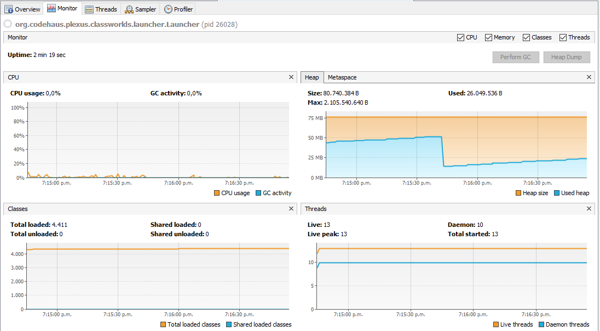
    
    El uso de CPU es muy bajo, llegando al 0% de uso. Un uso de memoria de 26MB.
    
    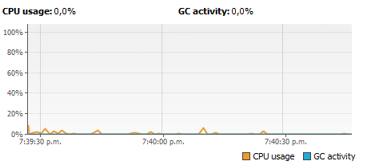

2. Con tantos threads como núcleos del computador. En nuestro caso java nos arroja que tenemos 4 núcleos.

    ``` 
      List<Integer> blackListOcurrences=hblv.checkHost("202.24.34.55", Runtime.getRuntime().availableProcessors());
    ``` 
   
   Vemos que el tiempo que le lleva completar el programa es de 38 segundos.
       
     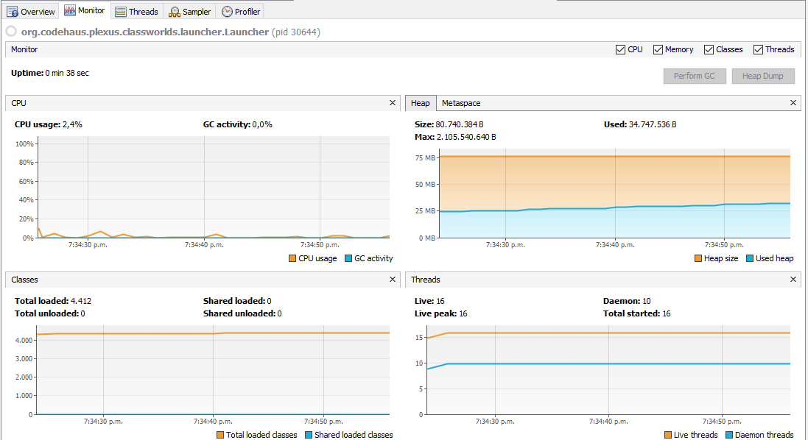
       
   El uso de CPU oscila entre 1,9% y 2,4%. Un uso de memoria de 34MB.
       
     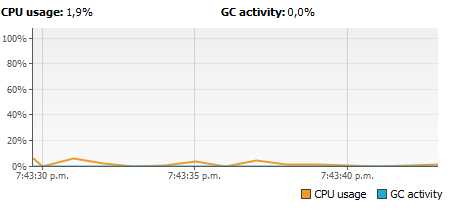
     
     
3. Tantos threads como el doble de núcleos.

   Vemos que el tiempo que le lleva completar el programa es de 21 segundos.
       
     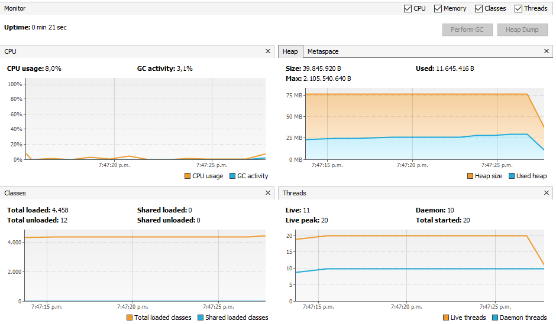
       
   El uso de CPU llega al 8%. Un uso de memoria de 11MB.
       
     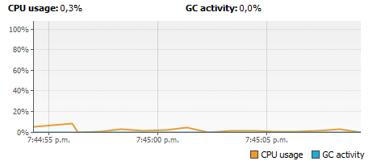

4. Con ***50*** threads. 

    Vemos que el tiempo que le lleva completar el programa es de 13 segundos.
           
      
           
    El uso de CPU llega al 13,3%. Un uso de memoria de 11,5MB.
           
      


5. Con ***100*** threads.

    Vemos que el tiempo que le lleva completar el programa es de 11 segundos.
               
      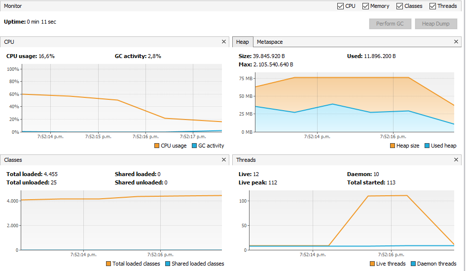
               
    El uso de CPU llega al 22,2%. Un uso de memoria de 11,9MB.
               
      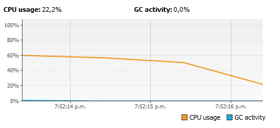
      
##### Resumen

Haciendo un gráfica de tiempo vs threads podemos ver que la mejora en tiempo tiende a ser nula entre más threads añadimos.

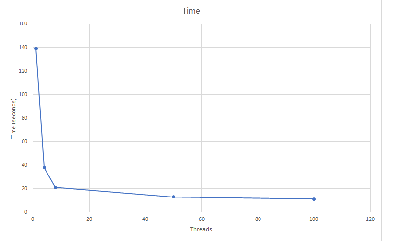

________________


## Construido con

* [Maven](https://maven.apache.org/) - Manejo de dependencias


## Contribuciones

* **Alejandro Vasquez** - *Extender* - [alejovasquero](https://github.com/alejovasquero)
* **Michael Ballesteros** - *Extender* - [Wasawsky](https://github.com/Wasawsky)